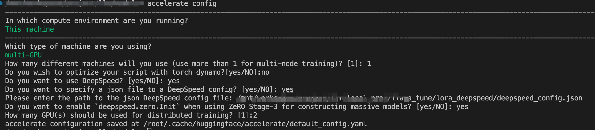

### deepspeed 训练注意事项

### 需要配置 accelerate config 
执行accelerate config，交互式的形式配置deep speed的参数。如下面图中的操作，具体参考[大模型入门（四）](https://www.cnblogs.com/jiangxinyang/p/17330352.html)。

### 需要修改一段源码
在执行代码时，会报下面的错误。
具体如何修改参考[大模型入门（四）](https://www.cnblogs.com/jiangxinyang/p/17330352.html)中的最后面的部分。